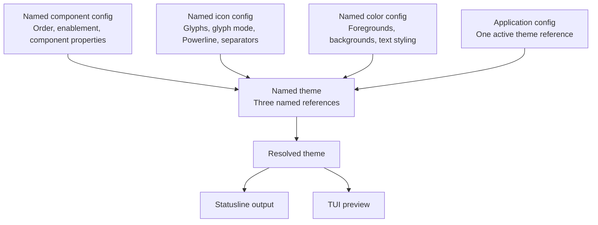

# Plan: named component, icon, and color configs

Status: implemented and verified on 2026-09-24; visual ownership remains provisionally accepted and can be revisited during use.

Replace self-contained theme files with independently named component, icon, and color configs. A named theme associates exactly one of each by name. Users activate a theme; both the statusline renderer and the TUI preview resolve those same associations.

The accepted decisions and implementation defaults below form the refactor baseline. The decision summary at the end distinguishes the provisional visual-ownership choice. Implementation was subsequently authorized, with commits at coherent checkpoints.

Implementation evidence:

- Catalog, store, and session now live in `src/config/{catalog,store,session}.rs`; the runtime `ResolvedTheme` is assembled from named references.
- The TUI has four sections, persistent drafts, typed dialogs, scoped save reviews, independent glyph/color editors, sharing/dependency actions, and width/height based layouts.
- `cargo test`: 134 passing tests (123 library, 7 binary, 4 CLI integration). Coverage includes atomic-write failure injection, competing writers, external conflicts, copy/fork dependencies, retained drafts, active-reference renames, read-only rendering, preview/ANSI parity, and responsive viewports.
- `cargo clippy --all-targets -- -D warnings`, `cargo fmt --check`, and `git diff --check` pass.
- Private tmux sessions exercised Unicode separator entry, RGB entry, save/activate/reopen, picker cancellation, scrolling, and resizing at 60×18, 80×24, 80×25, 80×30, and 120×40. Fresh raster captures were inspected at compact and wide sizes with color and without color. Terminal settings matched before/after exit; alternate screen was off and cursor visible afterward.
- Startup comparison: 60 alternating warm invocations of debug binaries, equivalent Default settings, the same controlled payload, and separate temporary config roots produced identical ANSI bytes. Median launch/render time was 69.11 ms before and 9.19 ms after; p95 was 71.96 ms before and 13.14 ms after. This local comparison found no startup regression; it is not a release-build performance guarantee.
- User-facing instructions and the schema example are in [CONFIGURATION.md](CONFIGURATION.md) and [examples/config.toml](../examples/config.toml). Personal old-theme conversion remains the agreed separate follow-up; no migration code or personal config changes were made.

## 1. Target model and scope



The refactor includes:

- First-class built-in and custom resources for all four kinds: component configs, icon configs, color configs, and themes.
- A versioned storage format, reference validation, and safe persistence.
- A redesigned TUI for composing themes and managing reusable configs, including clear shared-edit behavior.
- One resolution path for real output, previews, and resource-selection previews.
- Updated CLI behavior, documentation, fixtures, and regression coverage.

Keep component collection and existing payload support intact. This is not a redesign of Antigravity integration, a new component/plugin system, a terminal font detector, or a general configuration inheritance framework. Multiple instances of the same component, theme-local overrides, inheritance chains, and remote theme distribution are outside the first release.

There are no existing external users yet; the FOSS announcement is still ahead. Do not build migration commands, old-format readers, or compatibility storage paths. The maintainer's personal configs will receive a separate one-off conversion after the refactor, outside the shipped product and this implementation scope.

## 2. Pre-refactor implementation and constraints

These observations describe the checkout used when planning the refactor:

| Area | Current behavior | Refactor consequence |
| --- | --- | --- |
| [theme.rs](../src/config/theme.rs), [types.rs](../src/config/types.rs) | `UserTheme` embeds `active`, one `StyleMode`, and an ordered `Vec<ComponentConfig>`. Each component mixes behavior, icons, colors, and bold styling. | Separate persisted ownership from the assembled render model. |
| [manager.rs](../src/config/manager.rs) | Themes live at `themes/{Name}.toml`. Loading the active theme scans files and may rewrite active flags. Activation rewrites multiple files; saves use `fs::write`. | Use one active-theme reference and atomic persistence. Reads must not mutate configuration. |
| [presets](../src/presets/mod.rs) | Ten color schemes and five icon sets are copied into themes. Startup installs ten complete starter themes. | Turn presets into resolvable named resources instead of copy operations. Preserve the ten starter combinations. |
| [app.rs](../src/tui/app.rs) | One editable theme, one dirty flag, mixed component fields, file dialogs, and import menus. Theme cycling autosaves; opening through the menu asks about discarding. | Track resource drafts and use consistent navigation/save rules. |
| [import_menu.rs](../src/tui/widgets/import_menu.rs) | Presets can be hidden when equivalent values exist in a user theme. Some previews infer Powerline from a preset name or glyph and change other visual settings. | List resources by identity. Preview only the selected reference change. |
| [render.rs](../src/core/render.rs) | Plain/Nerd Font glyph selection and Powerline are combined into four `StyleMode` variants. Powerline uses hardcoded connectors and ignores the separator component's enabled flag. | Split glyph mode and Powerline explicitly; preserve effective separator behavior in the new defaults. |
| [statusline.rs](../src/core/statusline.rs), [model.rs](../src/core/components/model.rs) | Collection consumes component options and per-model icons. `thinking_icon` is stored in model options even though it is visual data. | Move glyph ownership without changing model formatting or dynamic-icon behavior. |
| [main.rs](../src/main.rs) | Bootstrap runs before deciding between TUI and piped rendering. | Separate editor initialization from read-only statusline loading. |

Existing behavior to retain includes `usage_5h`/`usage_7d` IDs, model effort and regex replacement options, Worktree/Git duplicate-branch handling, hostname trimming, PR hyperlinks, per-model glyph variants, Unicode display widths, background padding, and ANSI resets. Existing comments about old xline paths or a left/right separator are not authoritative: the current separator is inserted between visible segments.

## 3. Ownership decisions

Provisionally accepted decision (soft yes): icon configs own glyph mode, Powerline on/off, and separator behavior. Color configs own colors and bold styling. Use this ownership split as the implementation baseline, but revisit it if implementation or testing exposes usability or design problems.

| Data | Owner | Notes |
| --- | --- | --- |
| Ordered component list and enablement | Component config | One entry per supported data component; disabled entries retain their position and options. No add/remove UI. |
| Component behavior and formatting options | Component config | Includes effort visibility, model search/replacement, Git `show_sha` and `autohide_branch`, Worktree options, hostname `rstrip`, usage value, and PR options. |
| Plain and Nerd Font glyph strings | Icon config | Preserve strings, including empty strings, emoji sequences, variation selectors, and multiple codepoints. Do not constrain icons to one character. |
| Per-model glyphs and their enabled flag | Icon config | Include all current Gemini and Claude tiers, including Fable and Mythos. |
| Model thinking glyph | Icon config | Move `options.thinking_icon` here. Keep its current single-string behavior initially. |
| Glyph mode | Icon config | `plain` or `nerd_font`. Emoji is a preset, not a third glyph-selection mode. |
| Powerline on/off and connector glyphs | Icon config | Independent from glyph mode. Never infer this from a name or glyph. |
| Ordinary separator enablement and glyphs | Icon config | Remove the `Separator` pseudo-component from the component-order editor and persisted component list. |
| Icon/text foregrounds, backgrounds, text bold | Color config | Bold remains part of visual styling, matching existing color-scheme behavior. |
| Ordinary separator foreground | Color config | Use the separator icon color. Powerline transition colors derive from adjacent backgrounds. Do not carry over unused separator text/background/style fields. |
| Names of the three associated configs | Theme | No embedded resource bodies, style override, or `active` flag. |
| Active theme reference and schema version | Application catalog | Exactly one activation reference. |

An icon-config change must not reorder components or change colors. A color-config change must not change glyph mode, Powerline, or component properties. A component-config change must not copy visual values. Colors may still supply backgrounds when Powerline is off, as they do today.

### Separator and style semantics

Replace the persisted four-way `StyleMode` with two independent settings:

| Current mode | `glyph_mode` | `powerline` |
| --- | --- | --- |
| `plain` | `plain` | `false` |
| `nerd_font` | `nerd_font` | `false` |
| `powerline` | `nerd_font` | `true` |
| `plain_powerline` | `plain` | `true` |

When Powerline is off, insert the ordinary separator only when `separator.enabled` is true. When Powerline is on, insert its connector between rendered segments regardless of the ordinary separator setting. Label the latter setting accordingly in the TUI. Do not add leading/trailing caps or change whitespace rules as part of this refactor.

Store ordinary and Powerline glyph pairs separately. Initialize built-in Powerline connectors to the renderer's current effective values: `►` for plain and `\uE0B0` for Nerd Font. Ordinary separator glyphs come from each named icon config. Newly edited Powerline connectors will actually be honored. The table above specifies behavior, not an old-format migration API.

## 4. Names, presets, and references

Accepted decision: built-in themes and configs remain read-only. Customization creates separately named user resources, not editable overrides under built-in identities.

Use typed references such as `{ source = "builtin", name = "Nord" }` and `{ source = "user", name = "Workday" }`. The containing field determines the resource kind. The reference remains name-based; there are no hidden UUIDs or filename-based identities.

- Names are unique within a resource kind and source. A theme and a color config can both be called `Workday`.
- User resources never shadow built-ins. Show a Built-in/Custom badge when displaying names; source is always explicit in saved references.
- Trim surrounding whitespace at creation; reject empty names, control characters, and names longer than 200 UTF-8 bytes. Reject case-insensitive collisions within a kind/source using one shared normalization function; preserve the chosen spelling. References store and resolve the canonical spelling.
- Built-ins are shipped with the program, immutable in the editor, and not copied into the user catalog merely because the app starts. Customizing one creates a fully materialized user resource.
- Copies have no ongoing inheritance from their source. Built-ins may evolve with application releases; custom copies remain stable. Keep published built-in names stable; preset retirement is outside this refactor.
- Preserve all ten starter themes with explicit associations. Introduce a built-in Default component config from the current default layout/options; supply complete icon configs from the existing five sets, including current per-model defaults and explicit mode/separator settings.
- Presets remain visible even if a custom resource happens to contain identical values. Remove content-equality filtering and Powerline heuristics from the selection UI.

## 5. Storage and proposed schema

Accepted decision: store all named user resources and the active theme reference in one TOML catalog, with related changes saved atomically. The detailed schema remains proposed for review.

Use a **single user catalog at `<config-dir>/config.toml`**, containing the active theme reference and all user-defined resources. Keep TOML and the current config-directory precedence: `--config-dir`, `AGYLINE_CONFIG_DIR`, legacy `XLINE_CONFIG_DIR`, then `~/.config/agyline`. Keep Antigravity's `settings.json` separate.

This choice makes a shared-resource rename, a multi-resource save, and activation one atomic file replacement. It also makes copying/backing up a customization library straightforward. The tradeoff is a larger file, broader manual-edit conflicts, and catalog-wide failure for malformed TOML syntax. Separate files for each named resource are not part of the chosen design.

```text
<config-dir>/
  config.toml             # v2 user catalog; sole authority once present
  config.toml.lock        # writer coordination; never configuration data
```

Temporary files are created beside the catalog and never considered config inputs. No generated resolved-theme cache is persisted in the first implementation.

### Example catalog

This is a small catalog example, not the full shipped default. Table keys are resource names; serialized component keys remain machine IDs. Only two component entries are shown: missing supported entries appear disabled at the end of the editor's list and are materialized when that component config is explicitly saved.

```toml
schema_version = 2
active_theme = { source = "user", name = "Workday" }

[themes.Workday]
description = "Compact work statusline"
components = { source = "user", name = "Compact" }
icons = { source = "user", name = "Quiet" }
colors = { source = "user", name = "Muted" }

[component_configs.Compact]
description = "Model and project"

[[component_configs.Compact.components]]
id = "model"
enabled = true
options = { show_effort = "show", search = "", replace = "" }

[[component_configs.Compact.components]]
id = "directory"
enabled = true

[icon_configs.Quiet]
description = "Plain glyphs without Powerline"
glyph_mode = "plain"
powerline = false

[icon_configs.Quiet.defaults]
plain = ""
nerd_font = ""

[icon_configs.Quiet.components.model]
plain = "M"
nerd_font = "M"
thinking_icon = ""

[icon_configs.Quiet.separator]
enabled = true
plain = " | "
nerd_font = " | "
powerline_plain = "►"
powerline_nerd_font = "\uE0B0"

[color_configs.Muted]
description = "Subtle model emphasis"

[color_configs.Muted.defaults]
text_bold = false

[color_configs.Muted.components.model]
icon = { c16 = 14 }
text = { c16 = 7 }
text_bold = true

[color_configs.Muted.separator]
icon = { c16 = 8 }
```

Additional schema rules:

- Require `schema_version = 2`; reject unsupported versions without modifying the file. This catalog is the only supported on-disk format; no old-theme reader/importer is shipped.
- Use an ordered vector for component entries and deterministic maps for named resources and icon/color entries. Serialize consistently for readable diffs.
- Every component-config editor exposes all supported data components, excluding the Separator pseudo-component. Preserve stored order, then append missing supported entries in registry order with `enabled = false` and default behavior options. The same rule introduces future components disabled. Resolve this without writing or marking an untouched resource dirty; explicitly saving that resource materializes the complete list. All-disabled lists are valid. Users enable/disable and reorder entries rather than adding/removing them.
- Each icon/color config has a self-contained `defaults` entry. If a component-specific entry is absent, use that resource's defaults. If an entry exists, use it as a whole: omitted color fields mean no explicit color, and omitted `text_bold` means false. Do not apply a hidden built-in palette or merge individual fields from another resource.
- Icon entries carry both glyph variants. Model entries may additionally carry the per-model structure and `thinking_icon`; an absent per-model structure disables that feature. Use explicit plain/Nerd Font pairs for tier glyphs in the new schema; no legacy shorthand parser is required.
- Preserve the current `AnsiColor` encodings. Validate `c16` in 0–15, `c256` in 0–255, and RGB channels in 0–255. An omitted optional color means terminal/default behavior.
- Known component options keep their existing keys and supported values. Validate known option types; retain unknown option keys through load/save rather than dropping them.
- Preserve unrecognized component IDs as strings, including their options/icon/color entries. Warn and skip disabled/unused unknown components; an enabled unknown component prevents activation. Do not reuse the current `Unknown` deserialization path that discards their identity.
- Reject duplicate component IDs, malformed references, missing referenced resources, and misplaced/unknown structural fields with resource and field paths. Empty icon strings and a layout with no enabled components are valid.
- Empty catalogs still have a valid built-in active theme; custom tables can be absent. Broken references never silently become references to Default.

## 6. Resolution and persistence architecture

Introduce separate persisted and runtime types:

| Type/module | Responsibility |
| --- | --- |
| `Catalog`, `ResourceRef`, `NamedTheme` | Versioned user data and explicit references. |
| `NamedComponentConfig`, `NamedIconConfig`, `NamedColorConfig` | Independently editable resource bodies. Avoid confusing these with the current per-component types. |
| Preset registry | Built-in resources with the same domain interfaces as user resources. |
| `ResolvedTheme`, `ResolvedComponent`, resolved separator | Runtime values ready for collection/rendering, with no persistence or activation state. |
| `config/resolve.rs` | Pure reference lookup, validation, defaults, and assembly; accepts a catalog/registry or an editor draft overlay. |
| `config/store.rs` | Explicit config root, loading, optimistic conflict checks, writer coordination, and atomic saves. |
| `config/manager.rs` | Thin application-facing orchestration while callers move to the new modules. Keep setup/unsetup behavior separate. |

Resolution is: load the catalog once, resolve the named theme, resolve exactly its three references, complete the component list with missing supported entries disabled, walk that order, attach icon/color entries or that resource's defaults, and produce a resolved separator. Disabled entries remain in the editor model but are excluded from output. Component IDs, not vector positions, join the three resources.

Both `StatusLineGenerator` and TUI previews consume `ResolvedTheme`. Adapt existing rendering/component APIs incrementally, then remove their dependency on persisted `UserTheme`. Temporary in-memory adapters are acceptable while refactoring, but the completed product must not retain old-format loaders, two authoritative representations, or flattened theme files.

Move the model thinking glyph out of behavior options at the resolution/collection boundary. Preserve per-mode dynamic icon overrides and the current model-name/effort logic. Audit configurable glyphs explicitly; converting every hardcoded symbol in all component collectors into a new icon setting is a separate expansion.

Persistence requirements:

1. Build a candidate catalog by applying only the selected save scope to the saved base, then validate it and its reference graph. Unrelated drafts are not silently serialized or allowed to block a valid scoped save. Save/activate returns `Result`; callers cannot proceed to activation or exit after a failed save.
2. Coordinate application writers, then compare the on-disk content with the session's loaded base. If it changed externally, retain the draft and offer reload/review or save a separate catalog copy. Do not silently overwrite it. Document that external text editors do not honor the application lock.
3. Serialize completely, write a unique same-directory temporary file, flush/sync it, atomically replace the destination, and sync the containing directory where supported. Preserve existing permissions. Verify platform-specific replacement behavior before choosing the helper implementation.
4. Readers see either the previous complete catalog or the next complete catalog. They do not take a long-lived writer lock, bootstrap presets, normalize files on disk, or repair activation references.
5. On write failure, keep all drafts and show the destination/error. Treat an uncertain post-replacement durability error as an explicit recovery state requiring a reload; do not report an unqualified success or attempt activation/exit.

A malformed catalog is reported clearly. The TUI should provide a diagnostic/recovery view with the file and resource path; it must not overwrite it with defaults. Piped rendering reports configuration errors on stderr, returns nonzero, and emits no partial statusline. A syntax error affects the entire catalog; semantic errors should identify all affected resources in validation output.

## 7. Sharing, lifecycle, and activation

Accepted decisions: editing a shared config defaults to a named copy for the current theme, with shared editing explicit. Duplicating a theme reuses references by default; an extended Full fork action creates independent configs. Normal Save commits the current context and required related drafts; Save all is separate. Live output uses the active theme's saved references.

| Operation | Behavior |
| --- | --- |
| Customize built-in theme | Create a named custom theme draft referencing the same three configs before changing any association. Built-in theme definitions remain immutable; subsequent resource edits follow the copy/shared rules below. |
| Select a component/icon/color config for a theme | Change one reference in the theme draft; update the preview immediately; do not save or activate. |
| Customize for this theme | Copy the selected resource to a new user name and retarget only the current theme draft. This is the default editing path for built-ins and shared resources. |
| Edit shared config | Explicit action showing the referencing themes and whether the active theme uses it. Edit one shared resource; saving changes all users of that resource. |
| Edit an unshared custom config | Edit its draft directly, with its name/scope visible. |
| Duplicate theme | Create a new named theme reusing the existing three references. Do not copy configs or activate the duplicate. Later edits follow the accepted copy-before-edit rule. |
| Full fork (extended action) | Create a new named theme and three independent named user configs, including copies of any referenced built-ins. Save the fork as one unit; do not activate it automatically. |
| Save | Validate and commit the current theme/config and required related drafts as one atomic catalog transaction. Show the affected names; leave unrelated drafts pending and do not activate implicitly. |
| Save all | Validate and commit every pending draft and related reference change in one atomic catalog transaction; no implicit activation. |
| Activate | Resolve and validate the saved target, then update only `active_theme`. A dirty target requires Save and activate, not silent draft loss. |
| Save, activate, and exit | Save the current context and active reference in one validated catalog transaction. After success, use the normal exit flow for any remaining unrelated drafts; do not silently save or discard them. A failed commit does not activate or exit. |
| Rename custom config | Update its map key and every reference atomically. List affected themes before committing a shared rename. |
| Rename custom theme | Update its key and the active reference if applicable in the same transaction. |
| Delete config | Block deletion while referenced; list dependents. Require reassignment first. No cascade deletion. |
| Delete theme | Keep its configs. If active, require an explicit replacement theme as part of the same transaction. The built-in Default always remains available. |
| Restore built-in | Select the built-in reference again; never overwrite a same-named custom resource. |

Accepted live-output behavior: saving an active theme or a config referenced by the active theme changes the next rendered statusline, even though `active_theme` does not change. There is no separate activation snapshot. State this in the editor and save summary. “Save does not activate” must not imply that shared edits cannot affect current output.

### Save scope and retained drafts

- In the Themes section, Save includes the current theme draft and dirty/new user configs referenced by its draft, so the saved result matches its preview. Unrelated themes/configs stay unsaved.
- In a config library, Save normally includes only the current config. If it was created by Customize for this theme, include the originating theme's retarget and its required related drafts. A full fork similarly keeps its theme and three new configs together. Show this expanded scope before committing.
- Renames and other operations that must update references are indivisible. Include their required reference changes across the saved catalog, but do not pull unrelated edits from dependent theme drafts into the transaction. Apply the same reference updates to retained drafts.
- After a successful scoped save, advance the session's saved base, clear only the changes committed, and retain unrelated drafts and their dirty markers. Save all deliberately commits the entire draft set. Invalid unrelated drafts do not prevent a scoped save.
- Activate reads the saved target; if the current preview depends on dirty theme/config drafts, offer Save and activate using the same scope. Unsaved unrelated drafts do not prevent activation of a valid saved theme.

Build reverse references from the catalog rather than storing usage counts. Unused configs remain valid library entries and can be managed independently. Do not add automatic garbage collection in this refactor.

## 8. TUI redesign

Accepted structure: four top-level sections, **Themes, Components, Icons, Colors**. Themes compose and activate; the other sections manage named config libraries. Keep the preview and active/editing distinction visible across all sections.

```text
Active: Workday             Editing: Workday [unsaved]
Preview: <resolved draft statusline>

[Themes]  Components  Icons  Colors
+---------------------+-------------------------------------------+
| Theme library       | Workday                                   |
| Default  Built-in   | Components  Compact  Custom   [Choose/Edit]|
| Workday  Custom     | Icons       Quiet    Custom   [Choose/Edit]|
| Travel   Custom     | Colors      Muted    Custom   [Choose/Edit]|
|                     |                                           |
|                     | Save   Activate   Duplicate   Rename      |
+---------------------+-------------------------------------------+
Status / validation message / contextual key hints
```

The wireframe shows information hierarchy. The responsive layout below replaces the permanent library sidebar with a resource strip and chooser.

### Composition and resource editing

- Theme chooser rows show Built-in/Custom, Active, and Unsaved explicitly. Do not overload the existing `*` marker for both activation and dirty state.
- Selecting an association opens a searchable picker showing built-ins and customs with previews made by substituting only that association in the current draft. Enter accepts; Escape restores the prior reference and preview. Highlighting never writes anything.
- Component configs list every supported data component and have a behavior-only inspector. Preserve enable/disable, reorder controls, and conditional fields; do not add an add/remove workflow. New supported components appear disabled without disturbing existing order. Disabled entries keep their options and associated visual settings.
- Icon configs have global glyph-mode, Powerline, and separator controls plus a component glyph list and inspector. Reuse the existing icon catalog/search/custom-entry picker and per-model glyph editor. Global controls appear once, not once per component.
- Color configs have a component list, defaults/separator entries, and an inspector for icon/text/background colors and bold. Reuse 16-color, indexed, and RGB pickers. Make unset color distinct from black.
- Each library editor shows the resource name, source, unsaved state, and “Used by N themes”; the dependent list is inspectable. Label edits as affecting this theme's copy or the shared resource.
- Standalone config editing needs no new theme. Use the current preview theme with a temporary substitution; when no theme context exists, use built-in Default. Label that preview context, and never persist the substitution implicitly.
- Source fields missing a per-component icon/color entry show that the defaults are in use. Creating an override copies the effective entry; clearing the override returns to the resource's defaults.

### Drafts, focus, and navigation

- Replace `App.theme` and `is_dirty` with an editor session containing a saved base catalog, resource drafts keyed by kind/source/name, current theme context, and derived per-resource dirty state.
- Replace independent popup booleans with a typed modal state (or a small explicit modal stack where nested naming/pickers need it). Put resource CRUD and save/activate operations behind actions that return results.
- Accepted navigation behavior: keep drafts when switching sections/themes/resources. Remove autosave from theme cycling; navigation alone never changes the active output. Normal Save uses the current context; Save all is a separate action. On normal exit with remaining dirty drafts, offer Save all and exit, Discard remaining drafts and exit, or Cancel. Never exit after a failed save.
- Use one shared action/keymap definition for event handling and help text. Retain arrow/Tab navigation, Shift+Up/Down reorder in component lists, Enter/Space editing, and Escape to dismiss a modal. Keep global shortcuts out of text-entry handling; revise the old C/I import shortcuts to select/open named configs with visible hints.
- Keep Ctrl+C as the documented immediate exit that discards unsaved drafts, matching current behavior. Normal quit uses the dirty-state flow. Ensure raw mode/cursor/alternate screen are restored on errors and exits during the TUI changes.
- Store selection by resource/component identity where possible; clamp scrolling and field selection after rename, delete, filtering, or conditional-field changes.
- Load catalogs in application state, not inside widget render methods. Cache resolved draft previews until relevant state changes; rendering a frame must not scan disk.
- Guarantee every editing workflow at 60×18. Width and height are independent: at 80+ columns show a 31-column list and the remaining inspector; narrower terminals show the focused pane at full width, preserving focus and selection.
- Place a context-sensitive, windowed resource strip and searchable chooser below the four section tabs. It selects themes or the active section's named configs without a permanent third pane.
- Reserve one row each for context, section tabs, the resource strip, status, and contextual key hints. Use a one-line preview through height 21, a three-row bordered preview from height 22, and the full 11-row CLI-context preview only at width 80+ and height 30+, preserving at least 12 editor content rows. Drop blank spacers.
- Put scrolling indicators/counts in borders; derive scroll windows and page steps from actual viewport dimensions. Keep selected items, fields, and input cursors visible through filtering and resizing. Use display-width-aware truncation and an explicit preview overflow indicator.
- Fit dialogs to the terminal, using full-screen compact pickers when needed. Reserve input and action rows, scroll content independently, and wrap confirmation messages. At unsupported tiny sizes, show a minimum-size fallback without losing drafts or modal state.
- Show essential contextual key hints with a full Help view. Resize must never save, discard, accept a picker, or change logical focus. Preview-based navigation into editors is explicitly deferred.

Split the large `app.rs` along session/state, actions, library selection, and resource editors. Reuse the existing color/icon picker widgets and ring cursor rather than rewriting unrelated working controls.

## 9. Fresh-format cutover and CLI

Accepted decision: there are no existing external users, so omit product migration and compatibility code. Do not add `--migrate-config`, a migration dry-run/report, old-format fallback loading, dual writes, or a migration test suite. Remove the old theme-file loading/writing paths when the new catalog is wired in.

The new application reads only `config.toml` plus its built-in registry. If the catalog is absent, open/render built-in Default in memory and create the catalog only on explicit save/activation. If it is present but invalid or unsupported, report the error; do not replace it or fall back to old files. Existing `themes/*.toml` files are ignored and left untouched, not scanned, converted, or deleted.

After the refactor, convert the maintainer's personal configs as a separate one-off task against the final schema. Preserve the originals during that task. Do not ship that task's conversion logic in the application or make it a dependency of the refactor's completion gates.

With built-ins always available in memory, remove the obsolete `--install-themes` command and the TUI's “Reinstall default themes” action instead of maintaining compatibility shims. Built-in selection and customization replace them. Unknown CLI options, including removed commands, must return a usage error rather than fall through to launching the editor. Document the new catalog and preset workflow in help and README; no public migration or rollback guide is needed for this pre-announcement cutover.

Keep setup/setup-force/unsetup, payload logging, stdin/TTY dispatch, and config-dir overrides working. Add `--validate-config` for noninteractive schema/reference diagnostics; do not expand this into a full resource-management CLI in the first implementation.

The existing C/I “import” actions become named-config selection. General portable bundle import/export is deferred; the catalog itself is the initial backup/share artifact. A later bundle format must include referenced user resources and explicitly handle name collisions and built-in dependencies.

## 10. Implementation sequence and completion gates

Each phase should leave a working baseline; avoid a single replacement of storage, rendering, and TUI in one step.

| Phase | Work | Completion gate |
| --- | --- | --- |
| 0. Capture current behavior | Add fixtures for all starter themes, glyph/Powerline combinations, separators, dynamic model glyphs, and representative component options. Record current ANSI output and structured render lines with controlled inputs. | Baseline tests describe observed rendering behavior; capturing it does not require shipping an old-format reader. |
| 1. Define resources and resolver | Add catalog types, name/reference rules, read-only preset registries, validation, component-list completion, and pure resolution. | Example catalog parses; every built-in theme resolves; missing components appear disabled; changing one association changes only its owned data. |
| 2. Implement catalog storage | Add the catalog store, atomic writer/conflict detection, and scoped transaction support. | Fault injection and concurrent saves pass in temporary directories; a scoped save retains unrelated drafts and changes only its intended data. |
| 3. Move rendering to resolved themes | Adapt statusline generation, collectors, separator handling, preview helpers, and dynamic icons. Remove implicit disk writes and old-format reads from piped mode. | New fixtures match captured output where behavior is retained; preview and ANSI use the same resolved settings; saved active references immediately affect the next render. |
| 4. Build TUI composition/session | Introduce persistent drafts, modal/action state, four sections, named association pickers, active/unsaved indicators, scoped Save, Save all, and activation. | Users can compose, save, activate, reopen, and browse without navigation writes; unrelated drafts survive scoped saves. |
| 5. Finish resource editors/lifecycle | Split component/icon/color inspectors; list all supported components; add customize/shared edit, reference-reusing Duplicate, extended Full fork, rename, dependency-aware delete, and conflict/error UI. | Accepted shared/copy/fork workflows work end to end; failed operations retain drafts and do not activate or exit. |
| 6. Cut over and document | Wire validation, update help and README, and remove obsolete install/reinstall commands, old theme-file persistence, import/preset mutation paths, and stale xline comments. | Full checks and TUI smoke scenarios pass; fresh startup and the new storage/editing workflows are documented; no migration machinery ships. |

Phase 4 can initially reuse picker widgets, but the final UI must not retain a mixed editor that silently edits three resources. Remove obsolete UI paths after their replacements pass the corresponding scenarios, not before.

## 11. Verification plan

Use temporary config roots throughout; automated checks must never edit the developer's real catalog, personal theme files, or Antigravity settings.

| Test group | Required coverage |
| --- | --- |
| Schema and resolution | Round trips; all built-in references; missing/wrong-kind references; duplicate/case-colliding names and IDs; color bounds; all-disabled layouts/empty icons; Unicode sequences; defaults versus per-component entries; unsupported versions; preservation of unknown options and disabled unknown IDs. Missing supported components append disabled in registry order without disturbing existing order or writing files. |
| Ownership isolation | Swap each of the three references independently. Assert component order/options, icons/mode/separators, and colors/bold change only within the selected domain. |
| Rendering | Compare baseline ANSI and render structures for controlled payloads and all ten starter combinations. Cover glyph/Powerline combinations, ordinary separator disabled with Powerline on, custom connector glyphs, zero/one/many visible segments, hidden collectors, backgrounds, missing colors, glyph widths, per-model overrides, thinking glyphs, PR hyperlinks, Worktree/Git autohide, effort/regex behavior, and resets. Preview samples exercise the same dynamic-icon path where applicable. |
| Transactions | Inject failures before replacement and check the old catalog remains complete. Exercise post-replacement error reporting, save conflicts, concurrent activation/saves, reference renames without saving unrelated dependent drafts, active-theme deletion with replacement, and save/activate/exit failure gating. Test current-theme Save, standalone-config Save, required copy/fork dependencies, Save all, invalid unrelated drafts, and dirty-state rebasing after scoped saves. |
| TUI state | Four sections; all-component toggle/reorder without add/remove; navigation retains drafts without saving; picker cancel restores the draft; Duplicate reuses references; Full fork copies all three configs; default shared-config editing copies only the edited config; explicit shared save updates dependents; built-ins cannot be overwritten; normal exit handles remaining drafts; no drawing-time filesystem reads. |
| CLI and startup | `--config-dir` forms and env precedence; read-only rendering with absent/valid/invalid catalogs; old theme files ignored and untouched; validation errors and exit codes; removed install/migration commands unavailable; setup/unsetup and logging regressions; diagnostics never contaminate statusline stdout. |

Use Ratatui `TestBackend` snapshots/assertions for composition screens, each resource editor, sharing/save dialogs, empty/error states, and layouts at 80×24, 120×40, and a constrained size such as 60×18. Then run an actual TTY smoke test for icon/color text entry, modal focus, resize, save/activate, reopen, and terminal restoration. Visual checks should cover both plain fonts and Nerd Font/Powerline output without making font detection part of the feature.

Run the repository's standard checks after implementation:

```sh
cargo fmt --check
cargo test
cargo clippy --all-targets
cargo build
```

Measure repeated statusline invocations against the pre-refactor baseline using the same controlled payload and equivalent settings in separate temporary config roots. The new hot path should read at most one user catalog and must not scan old theme files, write configuration, or load the TUI icon catalog. Investigate material startup regressions before cutover; a new persistent cache is not the default remedy.

## 12. Release acceptance and decision summary

The refactor is complete when:

- [x] A theme contains exactly three named associations and can be the sole active selection.
- [x] Every config kind supports presets and named customs, independent management, and reuse across themes.
- [x] TUI and CLI output resolve the same values, including dynamic model icons and separator behavior.
- [x] Duplicate reuses references by default; extended Full fork creates independent configs; shared-config edits default to a copy, with explicit shared editing available.
- [x] Normal Save commits the current context and required related drafts; Save all commits all drafts; unrelated drafts remain pending after a scoped save.
- [x] Four TUI sections retain drafts while navigating, and every component config exposes all supported components with toggle/reorder controls and new additions disabled.
- [x] Saving changes used by the active theme affects the next render without reactivation or an activation snapshot.
- [x] Renaming/deleting resources cannot leave dangling references through application actions.
- [x] No migration code, old-format readers, or compatibility persistence paths ship; existing personal theme files remain untouched for the later one-off conversion.
- [x] Failed saves retain recoverable drafts and cannot trigger activation or exit as if successful.
- [x] Piped rendering is read-only, and catalog/preset selection no longer depends on scanning flattened themes.
- [x] Documentation explains resource ownership, source-qualified names, storage, sharing, Duplicate versus Full fork, scoped saving, activation, and the built-in customization workflow.

Accepted decisions from review:

1. **Storage — accepted:** one TOML catalog containing all named user resources and the active theme reference; related changes save atomically.
2. **Visual ownership — provisionally accepted (soft yes):** icon configs own glyph mode, Powerline on/off, and separator behavior; color configs own colors and bold styling. Revisit during implementation/testing as needed.
3. **Editing shared configs — accepted:** create a named copy for the current theme by default; editing the shared original is an explicit action.
4. **Theme duplication — accepted:** reuse references by default; provide a full fork through an extended action.
5. **Presets — accepted:** read-only built-ins; customization creates separately named user resources.
6. **Product migration — excluded:** no existing external users; omit migration effort/code. Convert the maintainer's personal configs in a separate one-off task after the refactor.
7. **TUI structure — accepted:** four top-level sections: Themes, Components, Icons, Colors.
8. **Navigation — accepted:** retain drafts in memory, save explicitly, and offer save/discard/cancel on normal exit; no autosave while browsing.
9. **Live output — accepted:** render the active theme's current saved references; saved edits take effect on the next render without reactivation.
10. **Save scope — accepted:** normal Save commits the current context and required related drafts; provide a separate Save all action.
11. **Component lists — accepted:** expose all supported components with enable/disable and ordering controls; future additions start disabled; no add/remove workflow.

Visual ownership in item 2 is intentionally provisional and may be revisited during implementation/testing. Other detailed mechanics in this document are implementation defaults consistent with the accepted choices. Continue updating this plan as implementation and testing refine the provisional choices. Implementation is now authorized; personal-config conversion remains a separate follow-up.
